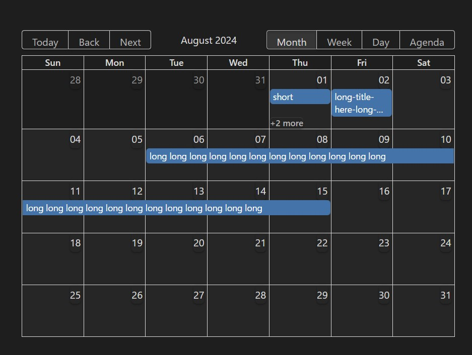
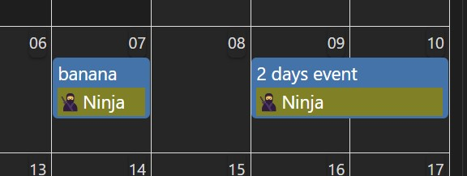
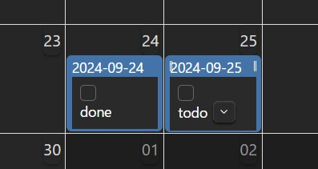
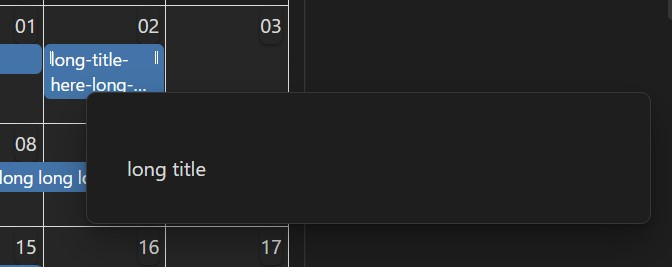
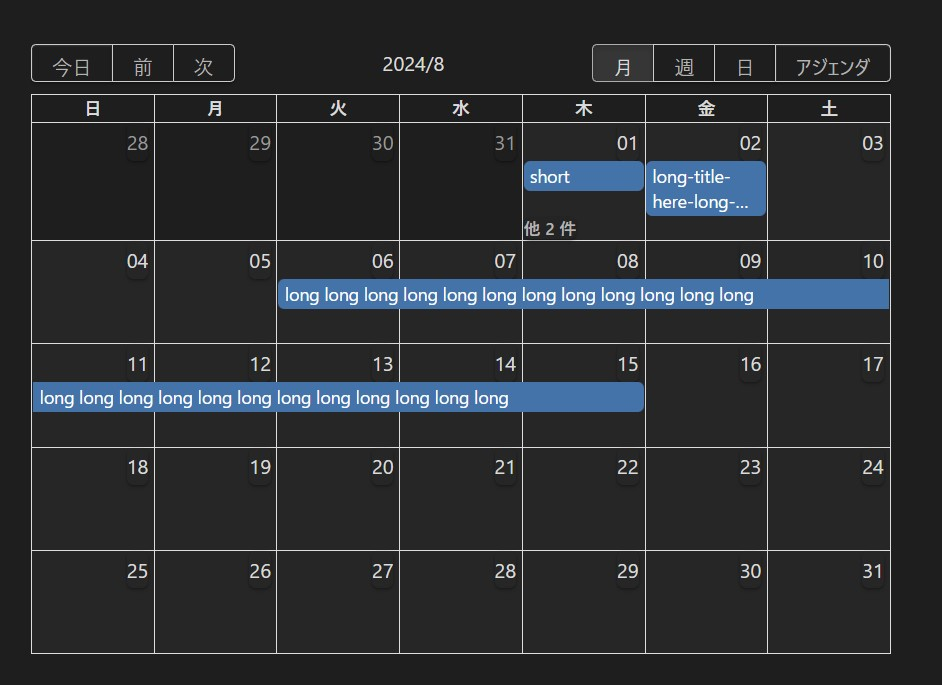

🚧 WIP!!! 🚧

# Obsidian Embed Calendar
You can embed a calendar in your Obsidian notes with this plugin.



## Features

- 🗓️ Supports month/week/day/agenda views
- 🖱️ Drag-and-drop date change
- 🆕 Create a new note with a specific date
- 🔍 Query of notes by plugin [Dataview](https://blacksmithgu.github.io/obsidian-dataview/)
- 👁️ Hover Preview
- 📝 Information other than the title can be freely displayed
- ⚙️ Possible to place any property change buttons if plugin [Metadata Menu](https://mdelobelle.github.io/metadatamenu/) is installed


## Installation
🚧 WIP!!! 🚧
Maybe you can install this with [BRAT](https://tfthacker.com/BRAT).

## QuickStart
Call `renderCalendar` as follows.

````
```dataviewjs
renderCalendar(
  this.container,
  dv.pages('"inbox"').map((p) => ({
    file: p.file,
    title: p.file.name,
    allDay: true,
  })),
  {
    dateFormat: "YYYY-MM-DD",
    startKey: "startDate",
    endKey: "endDate",
    newNoteFolder: "inbox",
    newNoteNameType: { type: "date", format: "YYYYMMDD" },
  },
);
```
````


## Usage
`renderCalendar` has 3 arguments.

1. This is the spell you need to display. Write `this.container`
2. query for notes using dataview
3. calendar options

Since 1 is fixed, let's take a closer look at 2 and 3.

## query for notes using dataview (2nd argument)
For this argument, pass an array of notes using dataview.

```js
dv.pages('"your-folder"').map((p) => ({
  file: p.file,
  title: p.file.name,
  allDay: true,
})),
```

The array of notes is processed as follows

| key      | description                                                         | required                    | example                      |
|----------|---------------------------------------------------------------------|-----------------------------|------------------------------|
| file     | Pass `file`. Fixed.                                                 | required                    | `p.file`                     |
| title    | String to be displayed as the title.                                | required                    | `p.file.name`                |
| allDay   | Whether the date is all day or not.                                 | optional. Default is `true` | `true`                       |
| metadata | If you pass a string or HTML, it will be displayed under the title. | optional. Default is `null` | `p.file.frontmatter['foo']` |

### metadata example
If you write `p.file.frontmatter['foo']` in `metadata`, you can display the value of the property (frontmatter).

If a string is passed, it is interpreted as HTML.

```js
metadata: "<p style='background-color:olive'>&#x1f977;Ninja</p>",
```



You can also write a process that returns an HTMLElement like [Metadata Menu](https://mdelobelle.github.io/metadatamenu/)'s API `fieldModifier`.

To display 1 property in Metadata Menu's API, write as follows.

```js 
const { fieldModifier: f } = MetadataMenu.api;
renderCalendar(
  this.container,
  dv.pages('"your-folder"').map((p) => ({
    file: p.file,
    title: p.file.name,
    allDay: false,
    metadata: f(dv, p, "check"),
  })),
  // ...
);
```

To display multiple properties in Metadata Menu's API, write as follows.

```js
const { fieldModifier: f } = MetadataMenu.api;
renderCalendar(
  this.container,
  dv.pages('"your-folder"').map((p) => {
    const metaDiv = dv.el("div", "");
    metaDiv.appendChild(f(dv, p, "check"));
    metaDiv.appendChild(f(dv, p, "status"));
    return {
      file: p.file,
      title: p.file.name,
      allDay: false,
      metadata: metaDiv,
    };
  }),
  // ...
);
```




## calendar options (3rd argument)

| key               | required |
|-------------------|----------|
| dateFormat        | required |
| startKey          | required |
| endKey            | optional |
| newNoteFolder     | required |
| newNoteNameType   | optional |
| newNoteMethodType | optional |
| defaultDate       | optional |
| defaultView       | optional |
| calendarHeight    | optional |
| eventFontSize     | optional |
| eventRowType      | optional |
| language          | optional |

### dateFormat
Required.  
Format of key to be used as date.
See [Day.js](https://day.js.org/docs/en/parse/string-format#list-of-all-available-parsing-tokens) for detailed format writing instructions.

example:
```js
dateFormat: "YYYY-MM-DD",
```

### startKey
Required.  
Key for the property of the note you want to treat as the start date and time of the event.

example:
```js
startKey: "date",
```

### endKey
Optional.  
Key for the property of the note you want to treat as the end date and time of the event.

If not written, the calendar will treat it as an “All-day Event that occurs on the day of startKey”.

example:
```js
endKey: "endDate",
```

### newNoteFolder
Required.  
<!-- TODO: ここから -->

example:
```js

```






## Contributing
🚧 WIP!!! 🚧

Set your vault path in `.env` as follows.

```sh
VAULT_PATH="<your-vault>"
# VAULT_PATH="/mnt/z/example-vault"
```

(Optional) It can be copied to the Vault for development. **All existing notes will be lost.**

```sh
npm run copy-vault
# pnpm run copy-vault
```

Install [pjeby/hot-reload](https://github.com/pjeby/hot-reload).
If hot-reload is already installed, turn hot-reload off once and then on again to recognize this plugin.

Execute the following.

```sh
npm run dev
# pnpm run dev
```

## Roadmap
This section is for my own use, so I might move it to GitHub's Project or something.

- [x] リンクを有効化
- [x] allDayのときのend
- [ ] カレンダーの初期表示の日付 (デフォルトは今日)
	- [x] 今日
	- [x] 固定
	- [ ] プロパティと連動(書き換えあり)
- [x] カレンダーの初期表示のView (デフォルトは月)
- [x] フォントサイズの変更
- [x] スタイルの調整
- [x] 2行
- [x] 言語の変更
- [x] エラー表示
- [x] titleの改行を有効化
- [x] D&Dによる日時移動
- [x] allDayの期間の終わりを正しく表示
- [x] D&Dによる日時範囲の変更
- [x] 新しいノートの作成
- [x] weekやDayで、短い期間でも選択可能にする
	- [x] weekやdayでホバーの範囲を文字列以外でも可能にする
- [x] Dataviewの読み込みができるまでは表示しない
- [x] metadataの表示
	- [x] metadataを複数表示
- [x] metadata menuの対応
- [x] app.cssの移行と
- [x] リンクCSSの解除をtailwindに戻す
- [x] サンプルのmdをdataviewjsに移行
- [x] ビルドが本番でも動くように変更
- [x] Settingsなど不要な部分を削除
- [ ] パースに失敗したEventをまとめて表示
	- [ ] 日時未定の場合は別途表示したい
- [ ] DevelopにMetadata Menuの設定例も書く
- [ ] DnDでendが無い場合は二日以上にさせない
- [ ] テストの追加
  - [ ] 参考: https://github.com/ycnmhd/obsidian-lineage
