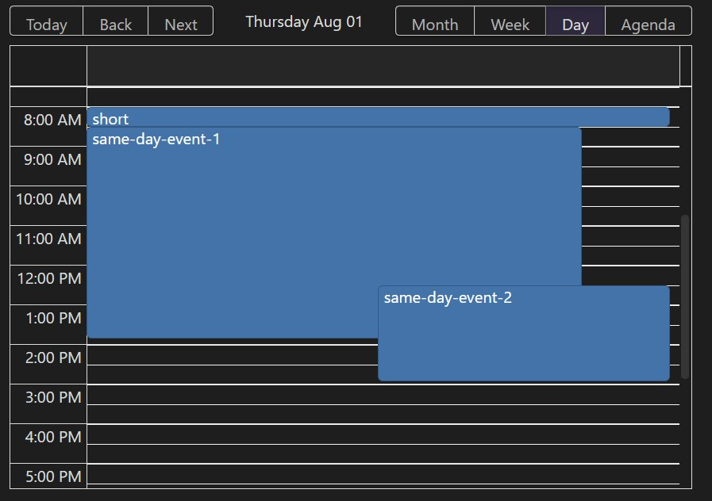

# Obsidian Embed Calendar
With this plugin, you can embed the calendar in the Obsidian note in the code block.


## Features

- 🗓️ Supports month/week/day/agenda views
- 🖱️ Drag-and-drop date change
- 🆕 Create a new note with a specific date
- 🔍 Query of notes by plugin [Dataview](https://blacksmithgu.github.io/obsidian-dataview/)
- 👁️ Hover Preview
- 📝 Information other than the title can be freely displayed
- ⚙️ Possible to place any property change buttons if plugin [Metadata Menu](https://mdelobelle.github.io/metadatamenu/) is installed




## Installation
🚧 WIP!!! 🚧
Maybe you can install this with [BRAT](https://tfthacker.com/BRAT).

- [Dataview](https://blacksmithgu.github.io/obsidian-dataview/) is required.
- [Metadata Menu](https://mdelobelle.github.io/metadatamenu/) is optional.

## QuickStart
Call `renderCalendar` as follows.

````
```dataviewjs
renderCalendar(
  this.container,
  dv.pages('"inbox"').map((p) => ({
    file: p.file,
    title: p.file.name,
    allDay: true,
  })),
  {
    dateFormat: "YYYY-MM-DD",
    startKey: "startDate",
    endKey: "endDate",
    newNoteFolder: "inbox",
    newNoteNameType: { type: "date", format: "YYYYMMDD" },
  },
);
```
````


## Usage
`renderCalendar` has 3 arguments.

1. This is the spell you need to display. Write `this.container`
2. query for notes using dataview
3. calendar options

Since 1 is fixed, let's take a closer look at 2 and 3.

## query for notes using dataview (2nd argument)
For this argument, pass an array of notes using dataview.

```js
dv.pages('"your-folder"').map((p) => ({
  file: p.file,
  title: p.file.name,
  allDay: true,
})),
```

The array of notes is processed as follows

| key      | description                                                         | required                    | example                      |
|----------|---------------------------------------------------------------------|-----------------------------|------------------------------|
| file     | Pass `file`. Fixed.                                                 | required                    | `p.file`                     |
| title    | String to be displayed as the title.                                | required                    | `p.file.name`                |
| allDay   | Whether the date is all day or not.                                 | optional. Default is `true` | `true`                       |
| metadata | If you pass a string or HTML, it will be displayed under the title. | optional. Default is `null` | `p.file.frontmatter['foo']` |

### metadata example
If you write `p.file.frontmatter['foo']` in `metadata`, you can display the value of the property (frontmatter).

If a string is passed, it is interpreted as HTML.

```js
metadata: "<p style='background-color:olive'>&#x1f977;Ninja</p>",
```


You can also write a process that returns an HTMLElement like [Metadata Menu](https://mdelobelle.github.io/metadatamenu/)'s API `fieldModifier`.

To display 1 property in Metadata Menu's API, write as follows.

```js 
const { fieldModifier: f } = MetadataMenu.api;
renderCalendar(
  this.container,
  dv.pages('"your-folder"').map((p) => ({
    file: p.file,
    title: p.file.name,
    allDay: false,
    metadata: f(dv, p, "check"),
  })),
  // ...
);
```

To display multiple properties in Metadata Menu's API, write as follows.

```js
const { fieldModifier: f } = MetadataMenu.api;
renderCalendar(
  this.container,
  dv.pages('"your-folder"').map((p) => {
    const metaDiv = dv.el("div", "");
    metaDiv.appendChild(f(dv, p, "check"));
    metaDiv.appendChild(f(dv, p, "status"));
    return {
      file: p.file,
      title: p.file.name,
      allDay: false,
      metadata: metaDiv,
    };
  }),
  // ...
);
```


## calendar options (3rd argument)

| key               | required |
|-------------------|----------|
| dateFormat        | required |
| startKey          | required |
| endKey            | optional |
| newNoteFolder     | required |
| newNoteNameType   | optional |
| defaultDateType   | optional |
| defaultView       | optional |
| calendarHeight    | optional |
| eventFontSize     | optional |
| eventRowType      | optional |
| language          | optional |

### dateFormat
Required.  
Format of key to be used as date.  
See [Day.js](https://day.js.org/docs/en/parse/string-format#list-of-all-available-parsing-tokens) for detailed format writing instructions.

example:
```js
dateFormat: "YYYY-MM-DD",
```

### startKey
Required.  
Key for the property of the note you want to treat as the start date and time of the event.

example:
```js
startKey: "date",
```

### endKey
Optional.  
Key for the property of the note you want to treat as the end date and time of the event.

If not written, the calendar will treat it as an “All-day Event that occurs on the day of startKey”.

example:
```js
endKey: "endDate",
```

### newNoteFolder
Required.  
Folder for creating new notes. New notes are created by clicking on an empty space in the calendar or by drag-and-drop.

example:
```js
newNoteFolder: "inbox",
```

### newNoteNameType
Optional.  
This is a way to determine the name of the new note. Currently there is only one type `date`.  
Default is as follows.
```js
{
  type: "date",
  format: "YYYYMMDDHHmmss",
},
```

example:
```js
newNoteNameType: { type: "date", format: "YYYY-MM-DD" },
```

#### type: date
Specify the date and time format as the name of the note.

```js
{
	type: "date",
	format: "YYYYMMDDHHmmss",
},
```


### defaultDateType
Optional.  
The date type on which the calendar will be based when it is first displayed.  
Default type is `today`.

example:
```js
defaultDateType: { type: "fixed", date: "2024-08-01" },
```

#### type: today
Today's date is used as the basis for when the calendar is first displayed.

```js
{ type: "today" },
```

#### type: fixed
The date specified in `date` is used as the basis for when the calendar is first displayed.

```js
defaultDateType: { type: "fixed", date: "2024-04-20" },
```

### defaultView
Optional.  
View to be treated as default from the following list.

- month
- week
- day
- agenda

Default is `month`.

example:
```js
defaultView: "week",
```

### calendarHeight
Optional.  
Calendar height in pixels.  
Default is `500`

example:
```js
calendarHeight: 600,
```

### eventFontSize
Optional.  
Event text size from the following list.  

- xs
- sm
- base
- lg

default is `xs`

example:
```js
eventFontSize: "base",
```

### eventRowType
Optional.  
Decide how many lines the title of the event will be from the following list.

- oneLine
- auto
- manual

default:
```js
eventRowType: { type: "oneLine" },
```

#### type: oneLine
Make the title of the Event one line.

```js
eventRowType: { type: "oneLine" },
```

#### type: auto
Automatically adjusts the title of the Event so that the specified number of lines are displayed.

```js
eventRowType: { type: "auto", rowNumber: 2 },
```

#### type: manual
You can put `\n` in the string to determine the line break position yourself.

Example of how to write in code block:

```js
renderCalendar(
  this.container,
  dv.pages('"zettelkasten"').map((p) => ({
    file: p.file,
    title: `${p.file.frontmatter.title}\nself new line`,
  })),
  {
    eventRowType: { type: "manual" },
		// ...
  },
);
```


### language
Optional.  
Calendar Language. Choose from the following list.

- en (English)
- ja (Japanese)

Default is `en`.

example:
```js
language: "ja",
```


## Contributing
🚧 WIP!!! 🚧

Set your vault path in `.env` as follows.

```sh
VAULT_PATH="<your-vault>"
# VAULT_PATH="/mnt/z/example-vault"
```

(Optional) It can be copied to the Vault for development. **All existing notes will be lost.**

```sh
npm run copy-vault
# pnpm run copy-vault
```

Install [pjeby/hot-reload](https://github.com/pjeby/hot-reload).
If hot-reload is already installed, turn hot-reload off once and then on again to recognize this plugin.

Install and configure the following two.

- [Dataview](https://blacksmithgu.github.io/obsidian-dataview/)
	- No setting required
- [Metadata Menu](https://mdelobelle.github.io/metadatamenu/)
	- Set `FileClass seettings` > `Class Files path` to `fileclass/` and **press the Save button**.

Execute the following.

```sh
npm run dev
# pnpm run dev
```

## Roadmap
This section is for my own use, so I might move it to GitHub's Project or something.

- [x] リンクを有効化
- [x] allDayのときのend
- [ ] カレンダーの初期表示の日付 (デフォルトは今日)
	- [x] 今日
	- [x] 固定
	- [ ] プロパティと連動(書き換えあり)
- [x] カレンダーの初期表示のView (デフォルトは月)
- [x] フォントサイズの変更
- [x] スタイルの調整
- [x] 2行
- [x] 言語の変更
- [x] エラー表示
- [x] titleの改行を有効化
- [x] D&Dによる日時移動
- [x] allDayの期間の終わりを正しく表示
- [x] D&Dによる日時範囲の変更
- [x] 新しいノートの作成
- [x] weekやDayで、短い期間でも選択可能にする
	- [x] weekやdayでホバーの範囲を文字列以外でも可能にする
- [x] Dataviewの読み込みができるまでは表示しない
- [x] metadataの表示
	- [x] metadataを複数表示
- [x] metadata menuの対応
- [x] app.cssの移行と
- [x] リンクCSSの解除をtailwindに戻す
- [x] サンプルのmdをdataviewjsに移行
- [x] ビルドが本番でも動くように変更
- [x] Settingsなど不要な部分を削除
- [ ] パースに失敗したEventをまとめて表示
	- [ ] 日時未定の場合は別途表示したい
- [ ] newNoteMethodTypeの実装
- [ ] Develop向けに、Metadata Menuを自動で設定できるようにする
- [ ] DnDでendが無い場合は二日以上にさせない
- [ ] テストの追加
  - [ ] 参考: https://github.com/ycnmhd/obsidian-lineage
